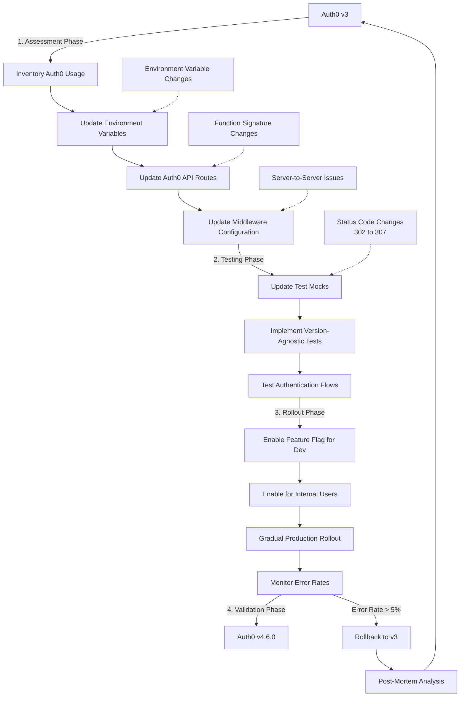

# Auth0 SDK Migration Guide

This guide provides a comprehensive strategy for migrating between Auth0 SDK versions, with specific focus on the migration from v3 to v4.6.0 based on our production experience.

## Table of Contents

1. [Migration Checklist](#migration-checklist)
2. [API Changes Between Versions](#api-changes-between-versions)
3. [Environment Variable Changes](#environment-variable-changes)
4. [Middleware Configuration Changes](#middleware-configuration-changes)
5. [Testing Strategy](#testing-strategy)
6. [Gradual Rollout Strategy](#gradual-rollout-strategy)
7. [Monitoring and Rollback Plan](#monitoring-and-rollback-plan)
8. [Migration FAQ](#migration-faq)
9. [Visual Migration Flowchart](#visual-migration-flowchart)
10. [Quick Reference Card](#quick-reference-card)
11. [Success Metrics Dashboard](#success-metrics-dashboard)

## Migration Checklist

### Pre-Migration Steps

- [ ] Review Auth0 SDK changelog for breaking changes
- [ ] Create a complete inventory of Auth0 SDK usage in your codebase
- [ ] Identify and document all environment variables in use
- [ ] Update local development .env files with new variable patterns
- [ ] Update Auth0 dashboard configuration for callback URLs
- [ ] Verify AUTH0_SECRET is exactly 32 characters (v4.6.0 requirement)

### Migration Implementation

- [ ] Install new Auth0 SDK version in a branch
- [ ] Update environment variable configurations
- [ ] Create adapters for API signature changes
- [ ] Update Auth0 API route handler
- [ ] Update middleware configuration
- [ ] Update tests to be version-agnostic
- [ ] Implement feature flags for gradual rollout

### Post-Migration Validation

- [ ] Verify login flow
- [ ] Verify logout flow
- [ ] Test protected pages
- [ ] Test protected API routes
- [ ] Verify role-based access control
- [ ] Verify session persistence across navigation
- [ ] Monitor authentication errors in production

## API Changes Between Versions

### Auth0 API Route Handler

```javascript
// Auth0 v3 (old)
// pages/api/auth/[...auth0].js
import { handleAuth, handleCallback, handleLogin, handleLogout } from '@auth0/nextjs-auth0';

export default handleAuth({
  login: handleLogin({ /* options */ }),
  callback: handleCallback({ /* options */ }),
  logout: handleLogout({ /* options */ })
});

// Auth0 v4.6.0 (new)
// pages/api/auth/[...auth0].js
import { handleAuth } from '@auth0/nextjs-auth0';

export default handleAuth();
```

### Session Management

```javascript
// Auth0 v3 (old)
const session = await getSession(req, res);

// Auth0 v4.6.0 (new)
const session = await getSession(req);
```

### Auth0Provider Component

```jsx
// Auth0 v3 (old)
import { UserProvider } from "@auth0/nextjs-auth0";

function MyApp({ Component, pageProps }) {
  return (
    <UserProvider>
      <Component {...pageProps} />
    </UserProvider>
  );
}

// Auth0 v4.6.0 (new)
// Same pattern, but with different internal behavior
import { UserProvider } from "@auth0/nextjs-auth0";

function MyApp({ Component, pageProps }) {
  return (
    <UserProvider>
      <Component {...pageProps} />
    </UserProvider>
  );
}
```

### Middleware Changes

```javascript
// Auth0 v3 (old)
import { withMiddlewareAuthRequired } from "@auth0/nextjs-auth0/edge";

// Auth0 v4.6.0 (new)
import { withMiddlewareAuthRequired } from "@auth0/nextjs-auth0";
```

## Environment Variable Changes

| Auth0 v3              | Auth0 v4.6.0        | Notes                                   |
| --------------------- | ------------------- | --------------------------------------- |
| AUTH0_ISSUER_BASE_URL | AUTH0_DOMAIN        | v4.6.0 removes https:// prefix          |
| AUTH0_BASE_URL        | APP_BASE_URL        | New name in v4.6.0                      |
| AUTH0_SECRET          | AUTH0_SECRET        | Must be exactly 32 characters in v4.6.0 |
| AUTH0_CLIENT_ID       | AUTH0_CLIENT_ID     | Same in both versions                   |
| AUTH0_CLIENT_SECRET   | AUTH0_CLIENT_SECRET | Same in both versions                   |

### Supporting Both Patterns

For a smoother migration, support both naming conventions:

```javascript
// next.config.js
module.exports = {
  env: {
    // Support both naming patterns
    AUTH0_DOMAIN:
      process.env.AUTH0_DOMAIN ||
      (process.env.AUTH0_ISSUER_BASE_URL
        ? process.env.AUTH0_ISSUER_BASE_URL.replace(/^https?:\/\//, "")
        : undefined),

    APP_BASE_URL: process.env.APP_BASE_URL || process.env.AUTH0_BASE_URL,
  },
};
```

## Middleware Configuration Changes

Auth0 v4.6.0 changes how middleware interacts with server-side routes. Ensure proper configuration:

```javascript
// src/middleware.ts
import { withMiddlewareAuthRequired } from "@auth0/nextjs-auth0";

export default withMiddlewareAuthRequired();

export const config = {
  matcher: [
    /*
     * Match all request paths except:
     * - api/public (API routes that don't require authentication)
     * - api/auth (Auth0 callback routes)
     * - _next/static (static files)
     * - _next/image (image optimization files)
     * - favicon.ico (favicon file)
     * - public folder
     * - api/webhooks (webhook endpoints)
     */
    "/((?!api/public|api/auth|_next/static|_next/image|favicon.ico|public|api/webhooks).*)",
  ],
};
```

### Key Differences to Note

1. **Status Code Changes**: Redirects use 307 in v4.6.0 (was 302 in v3)
2. **Server-to-Server Communication**: Webhook endpoints and CRON jobs need explicit exclusion
3. **Session Path**: `/api/auth/me` (v3) vs `/api/auth/session` (v4.6.0)

## Testing Strategy

### Version-Agnostic Testing

Update tests to be resilient to version changes:

```javascript
// Bad: Breaks on version changes
expect(response.status).toBe(302);

// Good: Works with both versions
expect(response.redirected).toBe(true);
expect(response.url).toContain("/api/auth/login");
```

### Component-Level Mocking

Instead of mocking Auth0 internals, mock entire components:

```javascript
// Bad: Coupled to Auth0 implementation
jest.mock("@auth0/nextjs-auth0", () => ({
  useUser: () => ({
    user: { name: "Test User" },
    error: null,
    isLoading: false,
  }),
}));

// Good: Resilient to Auth0 changes
jest.mock("../../pages/profile", () => () => (
  <div data-testid="profile-page">Mocked Profile Page</div>
));
```

### Session Mocking

Create an adapter for session mocking:

```javascript
// tests/helpers/auth0-mock.js
import { jest } from "@jest/globals";

// Mock Auth0 module
jest.mock("@auth0/nextjs-auth0", () => ({
  getSession: jest.fn(),
  withPageAuthRequired: jest.fn((component) => component),
  useUser: jest.fn(),
}));

// Import after mocking
import { getSession, withPageAuthRequired, useUser } from "@auth0/nextjs-auth0";

// Helper functions
export function setupAuthenticatedUser(userData = { name: "Test User" }) {
  useUser.mockReturnValue({
    user: userData,
    error: null,
    isLoading: false,
  });

  getSession.mockImplementation((req) => {
    // Support both v3 and v4.6.0 signatures
    return Promise.resolve({ user: userData });
  });
}

export function setupUnauthenticatedUser() {
  useUser.mockReturnValue({
    user: undefined,
    error: null,
    isLoading: false,
  });

  getSession.mockImplementation(() => Promise.resolve(null));
}

export function resetAuth0Mocks() {
  useUser.mockReset();
  getSession.mockReset();
  withPageAuthRequired.mockReset();
}
```

## Gradual Rollout Strategy

### Feature Flag Approach

Use feature flags to gradually roll out the new Auth0 version:

```javascript
// src/utils/auth/index.js
import { useUser as useAuth0User } from "@auth0/nextjs-auth0";
import { useFeatureFlag } from "../features";

export function useUser() {
  const useNewAuth0 = useFeatureFlag("use-auth0-v4");
  const auth0User = useAuth0User();

  if (useNewAuth0) {
    // v4.6.0 specific logic
    return {
      ...auth0User,
      // Any adaptation needed
    };
  } else {
    // v3 compatibility logic
    return auth0User;
  }
}
```

### Phased Rollout Plan

1. **Phase 1**: Enable for development environments only
2. **Phase 2**: Enable for internal users in production
3. **Phase 3**: Enable for 10% of users
4. **Phase 4**: Enable for 50% of users
5. **Phase 5**: Enable for all users

## Monitoring and Rollback Plan

### Monitoring Strategy

1. **Error Rate Monitoring**: Track authentication errors before/during/after migration
2. **Session Creation Rate**: Monitor successful session creation
3. **Login Success Rate**: Track successful logins vs attempts
4. **API Authentication Failures**: Monitor protected API route authentication failures

### Rollback Triggers

Roll back the migration if any of these occur:

1. Authentication error rate increases by more than 5%
2. Login success rate drops below 95%
3. Critical path functionality breaks for authenticated users
4. Multiple reports of session persistence issues

### Rollback Process

1. Disable feature flag for new Auth0 version
2. Revert to previous Auth0 SDK version
3. Restore previous environment variable configuration
4. Verify authentication flows after rollback
5. Analyze issues that triggered rollback

## Migration FAQ

### How do I handle the 32-character AUTH0_SECRET requirement?

Generate a secure random string exactly 32 characters long:

```bash
# Generate a secure 32-character string
openssl rand -base64 24 | tr -d "=+/" | cut -c1-32
```

### How do I debug redirect issues?

Use network monitoring to inspect the redirect chain:

1. Open browser DevTools
2. Go to Network tab
3. Check "Preserve log"
4. Attempt login
5. Look for 302 or 307 status codes in the redirect chain

### What if my tests fail after migration?

Focus on fixing these common test issues:

1. Update status code expectations (302 → 307)
2. Fix getSession function signature in mocks
3. Update API endpoint paths in tests
4. Use component-level mocking instead of Auth0 internal mocking

## Visual Migration Flowchart



## Quick Reference Card

### Auth0 Migration Do's and Don'ts

#### ✅ DO

- ✅ **Use component-level mocking** in tests instead of Auth0 internals
- ✅ **Exclude webhooks from middleware** to avoid authentication errors for server-to-server communication
- ✅ **Support both environment variable patterns** during transition for gradual rollout
- ✅ **Test both authenticated and unauthenticated states** after changes
- ✅ **Create version-agnostic assertions** in tests (e.g., `expect(response.redirected).toBe(true)`)
- ✅ **Implement feature flags** for controlled rollout
- ✅ **Monitor authentication errors** closely during migration

#### ❌ DON'T

- ❌ **Don't assert specific redirect status codes** (302 vs 307) in tests
- ❌ **Don't directly mock Auth0 SDK internals** in component tests
- ❌ **Don't migrate all users at once** without phased rollout
- ❌ **Don't hardcode Auth0 environment variable values** in application code
- ❌ **Don't remove support for old patterns** until migration is complete
- ❌ **Don't keep Auth0 implementation details** in your components

## Success Metrics Dashboard

Track these key metrics to evaluate migration success:

### Authentication Performance

| Metric                   | Pre-Migration | Post-Migration | Target        | Status |
| ------------------------ | ------------- | -------------- | ------------- | ------ |
| Avg Auth Latency         | \_\_\_ ms     | \_\_\_ ms      | 25% reduction | 📊     |
| Auth Requests/min        | \_\_\_        | \_\_\_         | No decrease   | 📊     |
| Session Persistence Rate | \_\_\_%       | \_\_\_%        | >99%          | 📊     |

### Error Rates

| Metric                  | Pre-Migration | Post-Migration | Target | Status |
| ----------------------- | ------------- | -------------- | ------ | ------ |
| Authentication Errors   | \_\_\_%       | \_\_\_%        | <1%    | 📊     |
| API Auth Failures       | \_\_\_%       | \_\_\_%        | <0.5%  | 📊     |
| Redirect Chain Failures | \_\_\_%       | \_\_\_%        | <0.1%  | 📊     |

### Test Stability

| Metric                     | Pre-Migration | Post-Migration | Target | Status |
| -------------------------- | ------------- | -------------- | ------ | ------ |
| Auth-Related Tests Passing | \_\_\_%       | \_\_\_%        | 100%   | 📊     |
| Test Coverage (Auth)       | \_\_\_%       | \_\_\_%        | >90%   | 📊     |
| Flaky Auth Tests           | \_\_\_        | \_\_\_         | 0      | 📊     |

### Migration Progress

| Phase              | Completion | Target Date | Status |
| ------------------ | ---------- | ----------- | ------ |
| Assessment         | \_\_\_%    | MM/DD/YYYY  | 🔄     |
| Environment Config | \_\_\_%    | MM/DD/YYYY  | 🔄     |
| API Routes         | \_\_\_%    | MM/DD/YYYY  | 🔄     |
| Middleware         | \_\_\_%    | MM/DD/YYYY  | 🔄     |
| Tests              | \_\_\_%    | MM/DD/YYYY  | 🔄     |
| Internal Rollout   | \_\_\_%    | MM/DD/YYYY  | 🔄     |
| Production Rollout | \_\_\_%    | MM/DD/YYYY  | 🔄     |

Track this dashboard weekly during migration to ensure progress and identify potential issues early.
