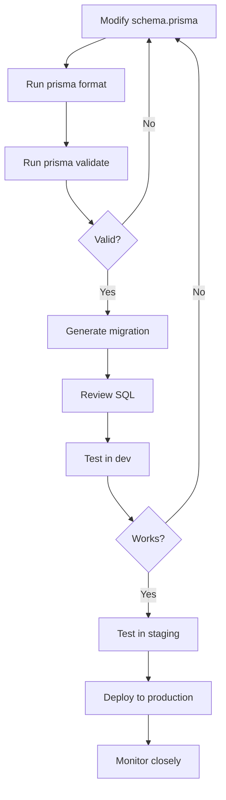

# Database Operations Complete Guide

**The definitive guide to safe, reliable, and scalable database operations for production systems.**

## Table of Contents

1. [Overview](#overview)
2. [Schema Management](#schema-management)
3. [Migration Strategies](#migration-strategies)
4. [Backup & Recovery](#backup--recovery)
5. [Performance Optimization](#performance-optimization)
6. [Monitoring & Alerting](#monitoring--alerting)
7. [Connection Management](#connection-management)
8. [Data Integrity](#data-integrity)
9. [Disaster Recovery](#disaster-recovery)
10. [Capacity Planning](#capacity-planning)

---

## Overview

### Database Operations Principles

1. **Safety First**: Never risk data loss
2. **Test Everything**: Validate in non-prod first
3. **Automate**: Reduce human error
4. **Monitor Closely**: Know your database health
5. **Plan for Failure**: Have rollback and recovery procedures

### Critical Database Metrics

```typescript
interface DatabaseMetrics {
  // Performance
  avgQueryTime: number;      // Milliseconds
  slowQueries: number;       // Count (> 1s)
  qps: number;               // Queries per second
  
  // Connections
  activeConnections: number;
  idleConnections: number;
  connectionPoolUsage: number;  // Percentage
  
  // Health
  replicationLag: number;    // Milliseconds
  cacheHitRatio: number;     // Percentage
  deadlocks: number;
  
  // Storage
  databaseSize: number;      // GB
  storageGrowth: number;     // GB per day
  largestTables: Array<{ name: string; size: number }>;
}
```

---

## Schema Management

### Schema-First Development

> **The Prisma schema is your single source of truth.**

```prisma
// schema.prisma - Single source of truth

model Organization {
  id          String   @id @default(uuid())
  name        String
  slug        String   @unique
  
  // Audit fields
  createdAt   DateTime @default(now())
  updatedAt   DateTime @updatedAt
  
  // Relationships
  users       User[]
  
  @@index([slug])
}

model User {
  id              String       @id @default(uuid())
  email           String       @unique
  organizationId  String
  
  // Relationships
  organization    Organization @relation(fields: [organizationId], references: [id], onDelete: Cascade)
  
  @@index([organizationId])
  @@index([email])
}
```

### Schema Change Workflow



### Pre-Migration Checklist

Before **any** schema change:

- [ ] Backup database
- [ ] Test migration in development
- [ ] Test migration in staging
- [ ] Review generated SQL
- [ ] Estimate migration duration
- [ ] Plan rollback procedure
- [ ] Schedule maintenance window (if needed)
- [ ] Notify team of deployment
- [ ] Monitor metrics after deployment

---

## Migration Strategies

### Zero-Downtime Migrations

#### Strategy 1: Expand-Contract Pattern

**Phase 1: Expand** (Add new, keep old)
```prisma
model User {
  // Old field (keep during transition)
  name     String?
  
  // New fields (nullable initially)
  firstName String?
  lastName  String?
}
```

**Phase 2: Migrate Data**
```typescript
// Backfill data from old to new columns
await prisma.$executeRaw`
  UPDATE "User"
  SET 
    "firstName" = SPLIT_PART("name", ' ', 1),
    "lastName" = SPLIT_PART("name", ' ', 2)
  WHERE "firstName" IS NULL
`;
```

**Phase 3: Contract** (Remove old)
```prisma
model User {
  // Old field removed
  // name     String?
  
  // New fields now required
  firstName String
  lastName  String
}
```

#### Strategy 2: Shadow Columns

**Add new column without dropping old**:
```sql
-- Add new column
ALTER TABLE "User" ADD COLUMN "email_new" VARCHAR(255);

-- Copy data
UPDATE "User" SET "email_new" = "email";

-- Application uses new column
-- Validate data correctness

-- Drop old column (separate deployment)
ALTER TABLE "User" DROP COLUMN "email";
ALTER TABLE "User" RENAME COLUMN "email_new" TO "email";
```

### Large Table Migrations

For tables with > 1M rows:

#### Option 1: Batched Migration
```typescript
// Migrate in batches to avoid long locks
async function migrateInBatches(
  tableName: string,
  batchSize: number = 10000
): Promise<void> {
  let offset = 0;
  let rowsUpdated = 0;
  
  while (true) {
    const result = await prisma.$executeRaw`
      UPDATE ${tableName}
      SET "new_column" = TRANSFORM("old_column")
      WHERE id IN (
        SELECT id FROM ${tableName}
        WHERE "new_column" IS NULL
        ORDER BY id
        LIMIT ${batchSize}
      )
    `;
    
    if (result === 0) break;
    
    rowsUpdated += result;
    console.log(`✅ Migrated ${rowsUpdated} rows`);
    
    // Small delay between batches
    await sleep(100);
  }
  
  console.log(`🎉 Migration complete: ${rowsUpdated} total rows`);
}
```

#### Option 2: Background Migration
```typescript
// Run migration as background job
async function backgroundMigration(): Promise<void> {
  const job = await createBackgroundJob({
    name: 'migrate-user-names',
    handler: migrateInBatches,
    retries: 3,
    timeout: 3600000  // 1 hour
  });
  
  console.log(`🚀 Started background migration: ${job.id}`);
}
```

### Rollback Procedures

**Always have a rollback plan!**

```typescript
// Example rollback script
async function rollbackMigration(): Promise<void> {
  console.log('🔄 Rolling back migration...');
  
  // 1. Restore old column
  await prisma.$executeRaw`
    ALTER TABLE "User" ADD COLUMN "name" VARCHAR(255)
  `;
  
  // 2. Copy data back
  await prisma.$executeRaw`
    UPDATE "User"
    SET "name" = CONCAT("firstName", ' ', "lastName")
  `;
  
  // 3. Drop new columns
  await prisma.$executeRaw`
    ALTER TABLE "User" DROP COLUMN "firstName"
  `;
  await prisma.$executeRaw`
    ALTER TABLE "User" DROP COLUMN "lastName"
  `;
  
  console.log('✅ Rollback complete');
}
```

---

## Backup & Recovery

### Automated Backup Strategy

```typescript
interface BackupConfig {
  // Continuous backups (point-in-time recovery)
  continuous: {
    enabled: true;
    retention: 7;  // Days
  };
  
  // Daily backups
  daily: {
    enabled: true;
    time: '02:00 UTC';
    retention: 30;  // Days
  };
  
  // Weekly backups
  weekly: {
    enabled: true;
    day: 'Sunday';
    time: '03:00 UTC';
    retention: 90;  // Days
  };
  
  // Monthly backups
  monthly: {
    enabled: true;
    day: 1;
    time: '04:00 UTC';
    retention: 365;  // Days (1 year)
  };
}
```

### Backup Verification

**Every backup must be tested!**

```typescript
// Automated backup testing
async function verifyBackup(backupId: string): Promise<void> {
  console.log(`🔍 Verifying backup: ${backupId}`);
  
  // 1. Restore to test environment
  const testDb = await restoreToTestEnv(backupId);
  
  // 2. Run integrity checks
  const checks = await runIntegrityChecks(testDb);
  if (!checks.passed) {
    throw new Error(`Backup verification failed: ${checks.errors}`);
  }
  
  // 3. Validate record counts
  const counts = await validateRecordCounts(testDb);
  if (!counts.match) {
    throw new Error(`Record count mismatch: ${counts.diff}`);
  }
  
  // 4. Test critical queries
  await testCriticalQueries(testDb);
  
  // 5. Clean up test environment
  await cleanupTestEnv(testDb);
  
  console.log(`✅ Backup verified: ${backupId}`);
}

// Run weekly backup verification
cron.schedule('0 0 * * 0', async () => {
  const latestBackup = await getLatestBackup();
  await verifyBackup(latestBackup.id);
});
```

### Point-in-Time Recovery

```bash
# Restore database to specific point in time
pg_restore \
  --host=production-db.example.com \
  --port=5432 \
  --username=admin \
  --dbname=app_db \
  --clean \
  --if-exists \
  --recovery-target-time='2024-11-20 14:30:00 UTC' \
  backup.dump

# Verify restoration
psql -h production-db.example.com -U admin -d app_db -c "SELECT NOW();"
```

### Recovery Time Objective (RTO)

**Target RTO by data criticality**:

| Data Type | RTO Target | Recovery Method |
|-----------|------------|-----------------|
| Critical (transactions) | 15 minutes | Hot standby + auto-failover |
| Important (user data) | 1 hour | Warm standby + manual failover |
| Standard (analytics) | 4 hours | Daily backup restore |
| Archive (old data) | 24 hours | Weekly backup restore |

---

## Performance Optimization

### Query Optimization

#### 1. Identify Slow Queries

```sql
-- Enable slow query logging (PostgreSQL)
ALTER DATABASE app_db SET log_min_duration_statement = 1000;  -- 1 second

-- View slow queries
SELECT
  query,
  mean_exec_time,
  calls,
  total_exec_time
FROM pg_stat_statements
WHERE mean_exec_time > 1000  -- > 1 second
ORDER BY mean_exec_time DESC
LIMIT 20;
```

#### 2. Add Missing Indexes

```prisma
// Identify missing indexes from query patterns

model Assessment {
  id              String       @id @default(uuid())
  organizationId  String
  status          String
  createdAt       DateTime     @default(now())
  
  // Add indexes for common query patterns
  @@index([organizationId, status])  // WHERE org + status
  @@index([organizationId, createdAt])  // WHERE org ORDER BY created
  @@index([status, createdAt])  // WHERE status ORDER BY created
}
```

#### 3. Optimize N+1 Queries

```typescript
// ❌ BAD: N+1 query problem
const organizations = await prisma.organization.findMany();
for (const org of organizations) {
  const users = await prisma.user.findMany({
    where: { organizationId: org.id }
  });
  // 1 query for orgs + N queries for users = N+1
}

// ✅ GOOD: Single query with include
const organizations = await prisma.organization.findMany({
  include: {
    users: true
  }
});
// 1 query total
```

### Connection Pool Tuning

```typescript
// Optimize connection pool size
const prisma = new PrismaClient({
  datasources: {
    db: {
      url: process.env.DATABASE_URL,
    },
  },
  // Connection pool configuration
  connection_limit: 20,          // Max connections
  pool_timeout: 10,              // Seconds to wait for connection
  connect_timeout: 10,           // Seconds to wait for initial connection
});

// Calculate optimal pool size
// Formula: connections = ((core_count * 2) + effective_spindle_count)
// For serverless: Start with 10-20 per function instance
```

### Query Result Caching

```typescript
// Cache expensive query results
import { Redis } from '@upstash/redis';

const redis = new Redis({
  url: process.env.REDIS_URL,
  token: process.env.REDIS_TOKEN
});

async function getCachedOrganizations(
  userId: string
): Promise<Organization[]> {
  const cacheKey = `user:${userId}:organizations`;
  
  // Try cache first
  const cached = await redis.get(cacheKey);
  if (cached) {
    console.log('✅ Cache hit');
    return cached as Organization[];
  }
  
  // Query database
  console.log('❌ Cache miss, querying database');
  const organizations = await prisma.organization.findMany({
    where: {
      users: {
        some: { id: userId }
      }
    }
  });
  
  // Cache for 5 minutes
  await redis.setex(cacheKey, 300, JSON.stringify(organizations));
  
  return organizations;
}
```

---

## Monitoring & Alerting

### Essential Database Alerts

```typescript
const databaseAlerts = [
  {
    name: 'High Connection Pool Usage',
    metric: 'connection_pool_usage',
    threshold: 80,  // Percentage
    severity: 'warning',
    action: 'Check for connection leaks, consider increasing pool size'
  },
  
  {
    name: 'Connection Pool Exhausted',
    metric: 'connections_waiting',
    threshold: 10,
    severity: 'critical',
    action: 'Immediate investigation, may need to kill long-running queries'
  },
  
  {
    name: 'Slow Queries',
    metric: 'slow_query_count',
    threshold: 100,  // Per minute
    severity: 'warning',
    action: 'Review slow query log, optimize queries or add indexes'
  },
  
  {
    name: 'Replication Lag',
    metric: 'replication_lag_ms',
    threshold: 60000,  // 1 minute
    severity: 'critical',
    action: 'Check replica health, may need to failover'
  },
  
  {
    name: 'High Disk Usage',
    metric: 'disk_usage_percentage',
    threshold: 80,
    severity: 'warning',
    action: 'Archive old data, increase storage, or clean up logs'
  },
  
  {
    name: 'Deadlocks',
    metric: 'deadlock_count',
    threshold: 5,  // Per hour
    severity: 'warning',
    action: 'Review queries causing deadlocks, optimize transaction scope'
  }
];
```

### Database Health Dashboard

```typescript
// Collect comprehensive database metrics
async function getDatabaseHealth(): Promise<DatabaseHealth> {
  return {
    // Connection metrics
    connections: {
      active: await getActiveConnections(),
      idle: await getIdleConnections(),
      waiting: await getWaitingConnections(),
      poolUtilization: await getPoolUtilization()
    },
    
    // Performance metrics
    performance: {
      avgQueryTime: await getAvgQueryTime(),
      slowQueries: await getSlowQueryCount(),
      qps: await getQueriesPerSecond(),
      cacheHitRatio: await getCacheHitRatio()
    },
    
    // Health indicators
    health: {
      replicationLag: await getReplicationLag(),
      deadlocks: await getDeadlockCount(),
      lockWaits: await getLockWaitCount()
    },
    
    // Storage metrics
    storage: {
      size: await getDatabaseSize(),
      growth: await getStorageGrowthRate(),
      largestTables: await getLargestTables(10)
    },
    
    // Overall status
    status: calculateOverallStatus()
  };
}
```

---

## Connection Management

### Prisma Singleton Pattern

```typescript
// lib/db.ts - Singleton to prevent connection pool exhaustion

import { PrismaClient } from '@prisma/client';

// PrismaClient is attached to the `global` object in development
// to prevent exhausting your database connection limit.

const globalForPrisma = global as unknown as {
  prisma: PrismaClient | undefined;
};

export const prisma =
  globalForPrisma.prisma ||
  new PrismaClient({
    log: process.env.NODE_ENV === 'development' 
      ? ['query', 'error', 'warn'] 
      : ['error'],
  });

if (process.env.NODE_ENV !== 'production') {
  globalForPrisma.prisma = prisma;
}

// Always use this import:
// import { prisma } from '@/lib/db';
```

### Connection Lifecycle

```typescript
// Proper connection handling in serverless
export async function handler(req: Request): Promise<Response> {
  try {
    // Use connection
    const result = await prisma.user.findMany();
    
    return Response.json(result);
    
  } catch (error) {
    console.error('Database error:', error);
    throw error;
    
  } finally {
    // Connection automatically returned to pool
    // No need to manually close in most cases
  }
}

// Only disconnect when shutting down
process.on('SIGTERM', async () => {
  await prisma.$disconnect();
});
```

---

## Data Integrity

### Constraints and Validation

```prisma
model User {
  id              String       @id @default(uuid())
  email           String       @unique  // Unique constraint
  organizationId  String
  
  // Foreign key with cascade delete
  organization    Organization @relation(
    fields: [organizationId], 
    references: [id], 
    onDelete: Cascade
  )
  
  // Check constraints (via migration)
  // ALTER TABLE "User" ADD CONSTRAINT email_format 
  //   CHECK (email ~* '^[A-Za-z0-9._%+-]+@[A-Za-z0-9.-]+\.[A-Z|a-z]{2,}$');
}
```

### Database Triggers

```sql
-- Audit log trigger
CREATE OR REPLACE FUNCTION audit_log_trigger()
RETURNS TRIGGER AS $$
BEGIN
  INSERT INTO audit_log (
    table_name,
    operation,
    old_data,
    new_data,
    changed_at,
    changed_by
  ) VALUES (
    TG_TABLE_NAME,
    TG_OP,
    to_jsonb(OLD),
    to_jsonb(NEW),
    NOW(),
    current_user
  );
  RETURN NEW;
END;
$$ LANGUAGE plpgsql;

-- Apply to sensitive tables
CREATE TRIGGER user_audit_log
  AFTER INSERT OR UPDATE OR DELETE ON "User"
  FOR EACH ROW EXECUTE FUNCTION audit_log_trigger();
```

### Data Validation in Application

```typescript
// Validate data before database operations
import { z } from 'zod';

const createUserSchema = z.object({
  email: z.string().email(),
  organizationId: z.string().uuid(),
  name: z.string().min(1).max(255)
});

async function createUser(data: unknown): Promise<User> {
  // Validate input
  const validated = createUserSchema.parse(data);
  
  // Additional business logic validation
  const orgExists = await prisma.organization.findUnique({
    where: { id: validated.organizationId }
  });
  
  if (!orgExists) {
    throw new Error('Organization not found');
  }
  
  // Create user
  return await prisma.user.create({
    data: validated
  });
}
```

---

## Disaster Recovery

### Multi-Region Replication

```typescript
interface ReplicationConfig {
  // Primary region
  primary: {
    region: 'us-east-1';
    endpoint: 'primary-db.example.com';
    role: 'read-write';
  };
  
  // Read replicas
  replicas: [
    {
      region: 'us-west-2';
      endpoint: 'replica-west.example.com';
      role: 'read-only';
      replicationLag: 'async';  // < 1 second typically
    },
    {
      region: 'eu-west-1';
      endpoint: 'replica-eu.example.com';
      role: 'read-only';
      replicationLag: 'async';
    }
  ];
  
  // Failover configuration
  failover: {
    automatic: true;
    healthCheckInterval: 30;  // Seconds
    failoverTimeout: 60;      // Seconds
  };
}
```

### Disaster Recovery Drills

```typescript
// Quarterly DR drill procedure
async function runDRDrill(): Promise<DRDrillResult> {
  console.log('🚨 Starting DR drill');
  
  const startTime = Date.now();
  
  // 1. Simulate primary failure
  await simulatePrimaryFailure();
  
  // 2. Initiate automatic failover
  const failover = await initiateFailover();
  
  // 3. Verify application connectivity
  const connectivity = await verifyApplicationConnectivity();
  
  // 4. Measure data loss (RPO)
  const dataLoss = await measureDataLoss();
  
  // 5. Measure recovery time (RTO)
  const recoveryTime = Date.now() - startTime;
  
  // 6. Restore original configuration
  await restoreOriginalConfig();
  
  const result = {
    success: connectivity.passed && dataLoss.seconds < 60,
    recoveryTime: recoveryTime / 1000,  // Seconds
    dataLoss: dataLoss.seconds,
    failoverSteps: failover.steps,
    issues: connectivity.issues || []
  };
  
  console.log(`✅ DR drill complete: ${JSON.stringify(result, null, 2)}`);
  
  return result;
}

// Schedule quarterly
cron.schedule('0 0 1 */3 *', runDRDrill);  // 1st day of quarter
```

---

## Capacity Planning

### Growth Forecasting

```typescript
// Forecast database growth
async function forecastDatabaseGrowth(): Promise<GrowthForecast> {
  // Get historical growth data
  const history = await getDatabaseSizeHistory(90);  // 90 days
  
  // Calculate growth rate
  const growthRate = calculateGrowthRate(history);
  
  // Forecast future capacity needs
  return {
    current: {
      size: await getCurrentDatabaseSize(),
      utilization: await getStorageUtilization()
    },
    
    forecast: {
      30days: projectSize(growthRate, 30),
      90days: projectSize(growthRate, 90),
      180days: projectSize(growthRate, 180),
      365days: projectSize(growthRate, 365)
    },
    
    recommendations: generateRecommendations(growthRate)
  };
}

// Example output
{
  current: {
    size: '50 GB',
    utilization: '40%'
  },
  forecast: {
    30days: '55 GB',
    90days: '65 GB',
    180days: '80 GB',
    365days: '110 GB'
  },
  recommendations: [
    'Current capacity sufficient for 12 months',
    'Plan storage expansion in Q3 2025',
    'Consider archiving data older than 2 years'
  ]
}
```

---

## Related Resources

### Rules
- @208-database-operations.mdc - Database operations standards
- @212-backup-recovery-standards.mdc - Backup and recovery
- @221-application-monitoring.mdc - Application monitoring

### Tools
- `.cursor/tools/inspect-model.sh` - Inspect Prisma models
- `.cursor/tools/check-schema-changes.sh` - Validate schema changes
- `.cursor/tools/backup-database.sh` - Manual database backup

### Guides
- `guides/Monitoring-Complete-Guide.md` - Monitoring best practices
- `guides/API-Database-Testing-Complete-Guide.md` - Database testing

---

## Quick Start Checklist

- [ ] Set up automated backups (daily, weekly, monthly)
- [ ] Test backup restoration procedures
- [ ] Configure database monitoring and alerts
- [ ] Implement connection pool optimization
- [ ] Add indexes for slow queries
- [ ] Set up replication for HA
- [ ] Document disaster recovery procedures
- [ ] Schedule quarterly DR drills
- [ ] Implement database audit logging
- [ ] Forecast capacity needs

---

**Time Investment**: 4-8 hours setup, ongoing maintenance
**ROI**: 99.9% uptime, < 15 minute recovery time, proactive capacity planning

