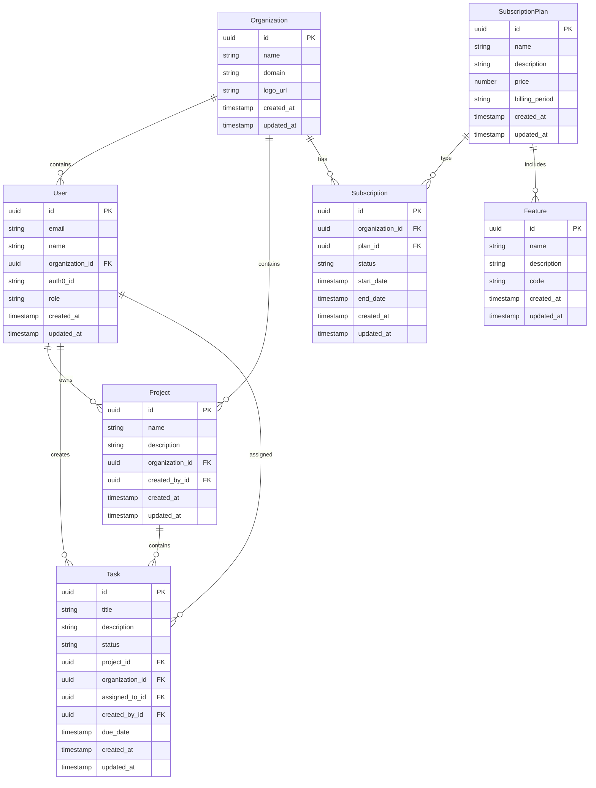

# VibeCoder Database Schema Guide

## Overview

This guide documents the database schema design for VibeCoder, including entity relationships, multi-tenancy implementation, and best practices for schema evolution.

## Entity-Relationship Diagram



## Core Tables

### Organization & User Management

- **organizations**: Tenant organizations

  - Primary entity for multi-tenant data isolation
  - All tenant-specific data has an `organization_id` foreign key

- **users**: User accounts synced from Auth0

  - Users belong to organizations
  - Can have different roles within each organization

- **user_profiles**: Extended user profile information
  - Linked to users with one-to-one relationship
  - Contains non-authentication user data

### Subscriptions & Features

- **subscription_plans**: Available subscription plans

  - Contains pricing and feature information
  - Platform-level entities (not tenant-specific)

- **subscriptions**: Organization subscription records

  - Links organizations to subscription plans
  - Tracks billing periods and status

- **features**: Features available in the platform

  - Referenced by subscription plans
  - Used for feature flagging in the application

- **plan_features**: Many-to-many relationship between plans and features
  - Defines which features are available in which plans

### Project Management

- **projects**: Work containers within organizations

  - Always belongs to a specific organization
  - Created by users within that organization

- **tasks**: Individual work items within projects

  - Belong to both a project and an organization
  - Can be assigned to users

- **comments**: User feedback on tasks
  - Nested within tasks
  - Created by users within the organization

## Multi-Tenancy Implementation

VibeCoder implements multi-tenancy using a row-level security approach at the database level, combined with application-level enforcement.

### Database-Level Tenant Isolation

1. **Row-Level Security Policies**

   - Every data table includes an `organization_id` column
   - PostgreSQL RLS policies enforce tenant isolation at the database level
   - Example policy:
     ```sql
     ALTER TABLE users ENABLE ROW LEVEL SECURITY;
     CREATE POLICY tenant_isolation_policy ON users
       USING (organization_id = current_setting('app.current_tenant_id')::uuid);
     ```

2. **Session Context Management**

   - Application sets tenant context for each database session
   - Example function to set context:
     ```sql
     CREATE OR REPLACE FUNCTION set_tenant_context(tenant_id uuid)
     RETURNS void AS $$
     BEGIN
       PERFORM set_config('app.current_tenant_id', tenant_id::text, false);
     END;
     $$ LANGUAGE plpgsql;
     ```

3. **Default Constraints**
   - Foreign key constraints enforce data integrity across tenant boundaries
   - Check constraints enforce tenant data consistency

### Application-Level Tenant Isolation

1. **Repository Pattern Enforcement**

   - All database access goes through repositories
   - Repositories automatically add tenant context to queries
   - Example repository method:
     ```typescript
     async findById(id: string, organizationId: string): Promise<User | null> {
       return await this.prisma.user.findFirst({
         where: {
           id,
           organizationId // Multi-tenancy enforcement
         }
       });
     }
     ```

2. **Middleware Tenant Context**

   - API middleware extracts tenant context from request
   - Sets database session context for all queries in the request
   - Example middleware:
     ```typescript
     export async function withTenantContext(req, res, next) {
       const organizationId = req.headers["x-organization-id"];
       await db.query("SELECT set_tenant_context($1)", [organizationId]);
       return next();
     }
     ```

3. **Data Validation**
   - Tenant context validated against user permissions
   - Cross-tenant operations explicitly authorized

## Schema Evolution Strategy

### Migration Principles

1. **Versioned Migrations**

   - All schema changes are versioned using Prisma Migrate
   - Migrations are stored in version control
   - Each migration has a clear, descriptive name
   - Example:
     ```
     20250601120000_add_user_preferences/
     20250602150000_add_project_templates/
     ```

2. **Backward Compatibility**

   - Schema changes maintain backward compatibility during transitions
   - Multi-phase approach for breaking changes:
     1. Add new structure without breaking existing code
     2. Deploy code that uses both old and new structures
     3. Deploy code that only uses new structure
     4. Remove old structure

3. **Zero-Downtime Migration**
   - Migrations designed to work without service interruption
   - Avoid long table locks or intensive operations
   - Use batching for large data migrations

### Data Migration Patterns

1. **Safe Column Additions**

   ```sql
   -- Safe: Adding nullable columns or columns with defaults
   ALTER TABLE users ADD COLUMN preferences JSONB DEFAULT '{}';
   ```

2. **Safe Column Removals**

   ```sql
   -- Safe: Only remove after code no longer uses it
   -- Phase 1: Mark as deprecated in code
   -- Phase 2: Remove column after all code updated
   ALTER TABLE users DROP COLUMN old_field;
   ```

3. **Safe Renaming Pattern**

   ```sql
   -- Instead of: ALTER TABLE users RENAME COLUMN name TO full_name;

   -- Phase 1: Add new column
   ALTER TABLE users ADD COLUMN full_name TEXT;

   -- Phase 2: Deploy code that writes to both columns

   -- Phase 3: Copy data
   UPDATE users SET full_name = name WHERE full_name IS NULL;

   -- Phase 4: Deploy code that only uses new column

   -- Phase 5: Remove old column
   ALTER TABLE users DROP COLUMN name;
   ```

4. **Safe Table Additions**

   ```sql
   -- Create new table
   CREATE TABLE project_templates (
     id UUID PRIMARY KEY DEFAULT gen_random_uuid(),
     name TEXT NOT NULL,
     organization_id UUID NOT NULL REFERENCES organizations(id),
     created_at TIMESTAMP NOT NULL DEFAULT NOW(),
     CONSTRAINT project_templates_organization_fk FOREIGN KEY (organization_id)
       REFERENCES organizations(id) ON DELETE CASCADE
   );

   -- Apply RLS policy
   ALTER TABLE project_templates ENABLE ROW LEVEL SECURITY;
   CREATE POLICY tenant_isolation_policy ON project_templates
     USING (organization_id = current_setting('app.current_tenant_id')::uuid);
   ```

## Best Practices

### Identifiers

- **UUIDs for Primary Keys**

  - All tables use UUIDs as primary keys
  - Avoids sequential ID exposure
  - Allows for distributed ID generation

- **Naming Conventions**
  - Table names: plural, snake_case (e.g., `user_profiles`)
  - Column names: snake_case (e.g., `created_at`)
  - Primary keys: `id`
  - Foreign keys: `<entity>_id` (e.g., `organization_id`)

### Standard Fields

- **Audit Fields**

  - All tables include `created_at` and `updated_at` timestamps
  - `created_by` tracks user who created the record (when applicable)
  - Example:
    ```sql
    created_at TIMESTAMP NOT NULL DEFAULT NOW(),
    updated_at TIMESTAMP NOT NULL DEFAULT NOW(),
    created_by_id UUID REFERENCES users(id)
    ```

- **Soft Deletes**
  - Use `deleted_at` timestamp for soft deletes
  - Queries filter out deleted records
  - Example:
    ```sql
    deleted_at TIMESTAMP,
    -- In queries
    WHERE deleted_at IS NULL
    ```

### Indexing Strategy

- **Primary Keys**

  - Every table has a primary key

- **Foreign Keys**

  - All foreign keys are indexed
  - Example:
    ```sql
    CREATE INDEX tasks_project_id_idx ON tasks(project_id);
    CREATE INDEX tasks_organization_id_idx ON tasks(organization_id);
    ```

- **Compound Indexes**

  - Created for common query patterns
  - Example:
    ```sql
    -- For queries that filter by organization and status
    CREATE INDEX tasks_organization_status_idx ON tasks(organization_id, status);
    ```

- **Full-Text Search**
  - Text search columns use GIN indexes
  - Example:
    ```sql
    -- For tasks where title/description is frequently searched
    CREATE INDEX tasks_text_search_idx ON tasks USING GIN (to_tsvector('english', title || ' ' || description));
    ```

### Constraints

- **Foreign Key Constraints**

  - Enforce referential integrity
  - Use appropriate cascade options
  - Example:
    ```sql
    CONSTRAINT tasks_project_fk FOREIGN KEY (project_id)
      REFERENCES projects(id) ON DELETE CASCADE
    ```

- **Unique Constraints**

  - Enforce uniqueness within appropriate scope
  - Often scoped to organization
  - Example:
    ```sql
    -- Project names unique within an organization
    UNIQUE (organization_id, name)
    ```

- **Check Constraints**
  - Enforce data validity
  - Example:
    ```sql
    -- Ensure status is valid
    CHECK (status IN ('todo', 'in_progress', 'done'))
    ```

## Testing Database Schema Changes

1. **Migration Tests**

   - Verify migrations apply cleanly
   - Test rollback procedures
   - Ensure data integrity after migration

2. **Performance Tests**

   - Measure query performance before and after changes
   - Test with representative data volumes
   - Verify index effectiveness

3. **Integration Tests**
   - Test application behavior with schema changes
   - Verify multi-tenant isolation

## Schema Documentation Practices

1. **Keep This Document Updated**

   - Update ERD when entities change
   - Document new tables and relationships

2. **Code Comments**

   - Add comments to Prisma schema
   - Document complex relationships

3. **Migration Documentation**
   - Each migration includes a description of changes
   - Document any special procedures needed

---

This guide should be reviewed and updated whenever significant schema changes are made to ensure it remains accurate and useful for the development team.
