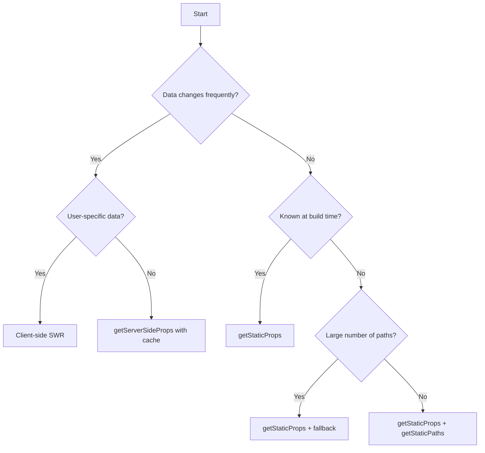

# VibeCoder Next.js Architecture Guide

## Introduction

This guide documents the architecture of the VibeCoder Next.js application, providing developers with a comprehensive understanding of the application structure, patterns, and conventions.

## Application Structure

### Directory Organization

```
/src
├── pages # Page components and API routes
│ ├── api # API endpoints
│ ├── auth # Authentication-related pages
│ └── [feature] # Feature-specific pages
├── components # Reusable UI components
│ ├── common # Cross-cutting components
│ ├── layout # Layout components
│ └── [feature] # Feature-specific components
├── hooks # Custom React hooks
├── context # React Context providers
├── lib # Core utilities and services
│ ├── api # API client implementations
│ ├── auth # Authentication utilities
│ └── [service] # Service-specific utilities
├── styles # Global styles and theming
├── types # TypeScript type definitions
└── utils # Utility functions
```

## Routing Architecture

### Page Structure

- Each page is a React component exported from a file in the `pages` directory
- Page components should be kept minimal, focusing on data fetching and layout composition
- Complex UI logic should be extracted to components and hooks

### Dynamic Routes

- Use Next.js dynamic routes for resource-based pages (e.g., `/projects/[projectId]`)
- Implement catch-all routes for nested resources using `[...slug]` syntax
- Add route guards using Higher Order Components for protected routes

### API Routes

- Structure mirrors frontend routes where applicable
- Use consistent response formatting across all API endpoints
- Implement middleware for cross-cutting concerns (auth, logging, etc.)

## Authentication Architecture

### Client-Side Authentication

- Use Auth0 React SDK for client-side state with proper error boundaries
- Implement loading states that prevent flash of unauthenticated content
- Handle token refresh transparently to users
- Create abstraction components that hide authentication implementation details

### Server-Side Authentication

- Use Auth0 Next.js SDK's getSession for SSR with proper typing
- Implement consistent redirect objects with preserved URLs
- Pass authentication state via hydratable props
- Never expose tokens or sensitive data in client-side props

### Middleware Authentication

- Configure middleware using explicit matcher patterns
- Implement proper public route exclusions with wildcard support
- Use NextResponse.redirect() with consistent status codes
- Apply error handling for all authentication operations

### Common Pitfalls (Based on Production Experience)

- **Inconsistent redirect handling**: Auth0 v4.6.0 uses NextResponse.redirect() differently than v3
- **Middleware matcher confusion**: Properly exclude static assets and auth routes
- **Session extraction errors**: Use proper error boundaries around getSession calls
- **Static asset blocking**: Not excluding /\_next/ paths can severely impact performance
- **Missing error handling**: Failed authentication calls without proper fallbacks

### Migration Patterns

- Create authentication wrappers that abstract library specifics
- Implement version detection for conditional behavior
- Document breaking changes with workarounds
- Use feature flags for gradual rollout of authentication changes

## Middleware Implementation

### Route-Based Middleware

- Configure middleware with precise matcher patterns:
  ```typescript
  export const config = {
    matcher: [
      // Apply to all routes except excluded paths
      "/((?!_next/|api/auth/|login|static|favicon.ico).*)",
    ],
  };
  ```
- Chain middleware functions with explicit ordering
- Pass context between middleware via request headers
- Implement proper error handling for middleware failures

### Edge vs. API Middleware

- Select Edge Runtime for performance-critical paths
- Use Node.js runtime for database-dependent middleware
- Understand execution order differences between edge and API routes
- Implement consistent error handling across both types

### Error Handling Patterns

- Implement consistent error responses for middleware failures
- Use custom error boundaries for authentication issues
- Log middleware errors with proper context
- Redirect to appropriate error pages for different failure types

### Common Pitfalls (Based on Production Experience)

- **Matcher syntax errors**: Test matcher patterns thoroughly
- **Static asset blocking**: Always exclude `_next/` paths
- **Redirect loops**: Verify excluded paths prevent circular redirects
- **Performance degradation**: Middleware runs on every request, keep it lightweight
- **Missing error handling**: Unhandled errors can block all requests

## Data Fetching Strategy

### Decision Framework

Use this evidence-based decision tree to select the appropriate data fetching strategy:



### Server-Side Rendering (SSR)

- Use `getServerSideProps` for pages requiring request-time data
- Implement proper error handling and loading states
- Cache SSR responses using Cache-Control headers where appropriate
- Add proper type safety to all data fetching functions

### Static Site Generation (SSG)

- Use `getStaticProps` for content that can be determined at build time
- Implement Incremental Static Regeneration (ISR) with appropriate revalidation intervals
- Use `getStaticPaths` with fallback strategies for collection pages
- Balance build time against coverage of pre-rendered pages

### Client-Side Fetching

- Use SWR for client-side data fetching with stale-while-revalidate caching
- Implement optimistic updates for better user experience
- Handle loading and error states consistently
- Provide appropriate fallback UI for data loading states

### Common Pitfalls (Based on Production Experience)

- **Unnecessary SSR**: Using getServerSideProps for static content
- **Missing cache headers**: Not setting Cache-Control in getServerSideProps
- **Prop serialization errors**: Passing non-serializable data from server
- **Over-fetching**: Fetching more data than needed for the current view
- **Missing error boundaries**: Not handling data fetching errors properly

## State Management Architecture

### Local Component State

- Use React's useState or useReducer for component-specific state
- Extract complex state logic to custom hooks
- Document state shape and transitions

### Application State

- Use React Context for feature-scoped shared state
- Implement context selectors to prevent unnecessary re-renders
- Create custom hooks to access context state with appropriate typing

### Server State

- Use SWR for managing server state with automatic revalidation
- Implement global SWR configuration for consistent behavior
- Document caching and revalidation strategies

## Performance Optimization

### Code Splitting

- Leverage Next.js automatic page-level code splitting
- Use dynamic imports for large components not needed on initial render
- Apply route-based prefetching for anticipated user journeys

### Image Optimization

- Use Next.js Image component for all images
- Implement proper sizing and formats
- Apply lazy loading for below-the-fold images

### Font Optimization

- Use Next.js Font module for web font optimization
- Implement proper font subsetting
- Apply font display strategies for better perceived performance

## Deployment Architecture

### Environment Configuration

- Use environment variables for configuration
- Separate client-side and server-side variables
- Document all required environment variables

### Build Process

- Use Next.js built-in build process
- Implement bundle analysis for monitoring bundle size
- Set up CI/CD pipeline for automated deployment

### Hosting

- Use Vercel for seamless Next.js deployment
- Implement staging environments for pre-production testing
- Set up monitoring and alerting for production environment

## Development Workflow

### Local Development

- Use Next.js development server with hot reloading
- Implement environment-specific configuration
- Use mock data for development when appropriate

### Testing Strategy

- Implement unit tests for components and utilities
- Use integration tests for feature flows
- Apply end-to-end tests for critical paths

### Code Quality

- Use ESLint and Prettier for code formatting
- Implement TypeScript for type safety
- Apply continuous integration checks for PRs

## Evidence-Based Best Practices

This guide incorporates best practices derived from real production issues documented in our HitList. These evidence-based patterns are designed to prevent common pitfalls and ensure a smooth development experience.

### Success Metrics

- Improved Core Web Vitals scores
- Reduced server load for static content
- Consistent caching behavior
- Zero authentication-related test failures
- Smooth migration path for dependency updates
