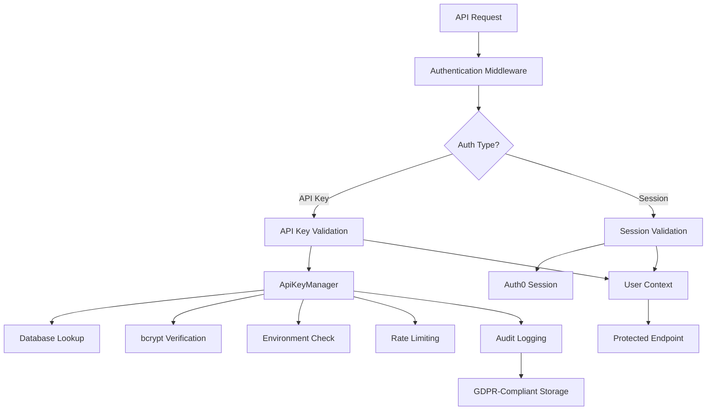

# Complete API Key Management System - Design & Implementation Guide

**Created**: August 2, 2025  
**Status**: ✅ **Production Ready**  
**Coverage**: Design, Implementation, Testing, and Standards

---

## 🎯 **Overview**

This document provides comprehensive guidance for building enterprise-grade API key management systems. It covers everything from security architecture to testing patterns, based on real-world implementation experience with VibeCoder's API key system.

---

## 📚 **Documentation Suite**

### **🔧 Design & Implementation**

- **[373-api-key-system-design.mdc](.cursor/rules/373-api-key-system-design.mdc)** - Core system architecture and security patterns
- **[374-authentication-architecture-standards.mdc](.cursor/rules/374-authentication-architecture-standards.mdc)** - Authentication middleware and dual-auth patterns

### **🧪 Testing Standards**

- **[372-api-key-testing-standards.mdc](.cursor/rules/372-api-key-testing-standards.mdc)** - Comprehensive testing patterns and requirements
- **[API Key Generation Complete Guide](../testing/API-Key-Generation-Complete-Guide.md)** - Detailed testing guide with examples

### **🏗️ Infrastructure**

- **[370-api-testing-database.mdc](.cursor/rules/370-api-testing-database.mdc)** - Database testing infrastructure
- **[371-api-test-architecture.mdc](.cursor/rules/371-api-test-architecture.mdc)** - API testing strategy and architecture

---

## 🏛️ **System Architecture**

### **Core Components**



### **Database Schema**

```sql
-- Secure API key storage
CREATE TABLE user_api_keys (
  id UUID PRIMARY KEY DEFAULT gen_random_uuid(),
  user_id TEXT REFERENCES users(id) ON DELETE CASCADE,
  key_hash VARCHAR(255) NOT NULL UNIQUE, -- bcrypt hash only
  key_hint VARCHAR(12), -- e.g., "vibe_...abc123"
  environment VARCHAR(10) DEFAULT 'live',
  is_active BOOLEAN DEFAULT true,
  expires_at TIMESTAMP DEFAULT (CURRENT_TIMESTAMP + INTERVAL '90 days'),

  -- Business constraints
  CONSTRAINT valid_environment CHECK (environment IN ('live', 'test', 'dev')),
  CONSTRAINT max_keys_per_env -- Enforced via unique index + business logic
);

-- GDPR-compliant audit trail
CREATE TABLE api_key_audit_log (
  id UUID PRIMARY KEY DEFAULT gen_random_uuid(),
  user_id TEXT NOT NULL,
  key_id UUID,
  action VARCHAR(50) NOT NULL,
  success BOOLEAN DEFAULT true,
  ip_address_hash VARCHAR(64), -- HMAC-SHA256 of IP
  user_agent TEXT,
  endpoint TEXT,
  response_code INTEGER,
  metadata JSONB,
  created_at TIMESTAMP DEFAULT CURRENT_TIMESTAMP
);
```

---

## 🔒 **Security Architecture**

### **Key Generation & Storage**

```typescript
// ✅ Cryptographically secure generation
const randomBytes = crypto.randomBytes(32); // 256-bit entropy
const apiKey = `vibe_${environment}_${randomBytes.toString("hex")}`;

// ✅ Secure hash storage (never store raw keys)
const keyHash = await bcrypt.hash(apiKey, 12); // 12 rounds minimum

// ✅ GDPR-compliant IP hashing
const ipHash = crypto.createHmac("sha256", salt).update(ip).digest("hex");
```

### **Environment Isolation**

- **Live Keys**: `vibe_live_*` - Production environment only
- **Test Keys**: `vibe_test_*` - Testing environment only
- **Dev Keys**: `vibe_dev_*` - Development environment only

### **Rate Limiting Strategy**

```typescript
const DEFAULT_RATE_LIMITS = {
  live: { perMinute: 60, perHour: 1000, burstAllowance: 5 },
  test: { perMinute: 120, perHour: 2000, burstAllowance: 10 },
  dev: { perMinute: 240, perHour: 5000, burstAllowance: 20 },
};
```

---

## 🔄 **Business Logic Patterns**

### **Key Lifecycle Management**

1. **Generation**: Secure creation with environment prefixes
2. **Validation**: Constant-time bcrypt comparison with environment checks
3. **Rotation**: Zero-downtime key replacement with grace periods
4. **Expiration**: Automatic expiry with 14-day warnings
5. **Revocation**: Immediate deactivation with audit trails

### **Usage Limits & Constraints**

- **Maximum Keys**: 2 per user per environment
- **Default Expiry**: 90 days with configurable extensions
- **Grace Periods**: 7 days for key rotation overlaps
- **Audit Retention**: Permanent audit trail for compliance

---

## 🛡️ **Authentication Middleware**

### **Dual Authentication Pattern**

```typescript
export function withAuth(handler: NextApiHandler) {
  return async (req: NextApiRequest, res: NextApiResponse) => {
    // 1. Try API key authentication first
    const apiKeyAuth = await tryApiKeyAuth(req);
    if (apiKeyAuth.success) {
      req.user = {
        sub: apiKeyAuth.userId,
        authType: "api_key",
        keyId: apiKeyAuth.keyId,
        environment: apiKeyAuth.environment,
      };
      return handler(req, res);
    }

    // 2. Fall back to session authentication
    const sessionAuth = await trySessionAuth(req, res);
    if (sessionAuth.success) {
      req.user = {
        sub: sessionAuth.user.sub,
        authType: "session",
        email: sessionAuth.user.email,
      };
      return handler(req, res);
    }

    // 3. Return standardized error
    return res.status(401).json({
      error: "Authentication required",
      code: "AUTH_REQUIRED",
      hint: "Provide valid API key or authenticate with session",
    });
  };
}
```

### **Environment-Aware Protection**

```typescript
export function withEnvironmentAuth(
  handler: NextApiHandler,
  options: {
    allowedEnvironments?: ("live" | "test" | "dev")[];
    requirePermissions?: string[];
  } = {}
) {
  return withAuth(async (req: AuthenticatedRequest, res: NextApiResponse) => {
    // Environment validation for API keys
    if (req.user.authType === "api_key" && options.allowedEnvironments) {
      if (!options.allowedEnvironments.includes(req.user.environment!)) {
        return res.status(403).json({
          error: "Environment not allowed",
          code: "ENVIRONMENT_FORBIDDEN",
          allowed: options.allowedEnvironments,
        });
      }
    }

    return handler(req, res);
  });
}
```

---

## 🧪 **Testing Architecture**

### **Test Infrastructure Overview**

```bash
# Database-focused tests (business logic)
jest.database.config.js
├── __tests__/api-key-rotation.test.ts      # 5/5 ✅ Complex workflows
├── __tests__/api-key-security.test.ts      # 9/9 ✅ Security validations
└── __tests__/api-key-limits.test.ts        # 12/12 ✅ Business logic

# API endpoint tests (integration)
jest.api.config.js
├── __tests__/api-key-endpoints-simple.test.ts  # 7/7 ✅ Real endpoints
└── tests/helpers/api-test-helpers.ts           # Reusable utilities
```

### **Testing Pattern Examples**

#### **Security Testing**

```typescript
test("🛡️ Should validate environment prefixes correctly", async () => {
  const liveKey = "vibe_live_" + "a".repeat(64);
  const testKey = "vibe_test_" + "b".repeat(64);

  expect(ApiKeyManager.validateEnvironmentPrefix(liveKey, "live")).toBe(true);
  expect(ApiKeyManager.validateEnvironmentPrefix(liveKey, "test")).toBe(false);
});
```

#### **Business Logic Testing**

```typescript
test("❌ Should enforce maximum key limit per environment", async () => {
  (mockSql as jest.Mock).mockResolvedValueOnce([{ count: 2 }]);

  await expect(
    ApiKeyManager.generateApiKey(userId, { environment: "live" })
  ).rejects.toThrow("Maximum API keys (2) already exist");
});
```

#### **Complex Workflow Testing**

```typescript
test("✅ Should rotate API key successfully", async () => {
  // Mock 6-step database workflow
  (mockSql as jest.Mock)
    .mockResolvedValueOnce([
      { environment: "live", key_name: "Production Key" },
    ])
    .mockResolvedValueOnce([{ count: 1 }])
    .mockResolvedValueOnce([{ id: "new-key-789", created_at: new Date() }])
    .mockResolvedValueOnce([]) // Audit log for new key
    .mockResolvedValueOnce([{ id: oldKeyId }]) // Update old key
    .mockResolvedValueOnce([]); // Audit log for rotation

  const result = await ApiKeyManager.rotateApiKey(userId, oldKeyId);
  expect(result.keyId).toBe("new-key-789");
  expect(mockSql).toHaveBeenCalledTimes(6);
});
```

---

## 📊 **Implementation Checklist**

### **✅ Security Requirements**

- [ ] Use cryptographically secure key generation (`crypto.randomBytes`)
- [ ] Implement bcrypt hashing with minimum 12 rounds
- [ ] Store only hashes, never raw keys
- [ ] Implement environment prefix validation
- [ ] Hash IP addresses for GDPR compliance
- [ ] Implement constant-time comparisons
- [ ] Add comprehensive audit logging

### **✅ Business Logic Requirements**

- [ ] Enforce maximum key limits (2 per user/environment)
- [ ] Implement automatic expiration (90-day default)
- [ ] Support key rotation with grace periods
- [ ] Track usage statistics (last_used_at, usage_count)
- [ ] Provide key hints for user identification
- [ ] Support different rate limits per environment

### **✅ Database Requirements**

- [ ] Create proper database constraints and indexes
- [ ] Implement audit trail table with GDPR compliance
- [ ] Use UUIDs for non-predictable key IDs
- [ ] Add performance indexes on frequently queried fields
- [ ] Implement soft deletion with revoked_at timestamps

### **✅ API Design Requirements**

- [ ] Support dual authentication (sessions + API keys)
- [ ] Return comprehensive error codes and messages
- [ ] Implement proper HTTP status codes
- [ ] Validate all input parameters
- [ ] Return API keys only once during generation
- [ ] Support environment-specific operations

### **✅ Testing Requirements**

- [ ] Test security validations (bcrypt, environment isolation)
- [ ] Test business logic enforcement (limits, expiry)
- [ ] Test complex workflows (rotation, validation chains)
- [ ] Test error scenarios (invalid inputs, database errors)
- [ ] Test API endpoint integration
- [ ] Achieve 100% test coverage for critical paths

---

## 🚀 **Production Deployment**

### **Environment Configuration**

```bash
# Required environment variables
IP_HASH_SALT=secure-random-salt-for-gdpr-compliance
BCRYPT_ROUNDS=12  # Minimum for production
MAX_KEYS_PER_ENVIRONMENT=2
DEFAULT_EXPIRY_DAYS=90
```

### **Monitoring & Alerting**

- **Key Generation Rate**: Monitor for unusual spikes
- **Validation Failures**: Alert on high failure rates
- **Expiry Warnings**: Notify users 14 days before expiry
- **Rate Limit Breaches**: Track API abuse patterns
- **Security Events**: Monitor for brute force attempts

### **Performance Considerations**

- Index frequently queried fields (`user_id`, `environment`, `is_active`)
- Use connection pooling for database operations
- Implement caching for valid key validations (short TTL)
- Consider read replicas for high-traffic validation

---

## 🔗 **Related Documentation**

### **Quick References**

- **[API Testing Database Guide](../testing/API-Testing-Database-Guide.md)** - Database testing setup
- **[Quick Start API Testing](../testing/Quick-Start-API-Testing.md)** - 5-minute testing guide
- **[Complete Testing Infrastructure](../testing/Complete-Testing-Infrastructure-Summary.md)** - Full testing overview

### **Rule References**

- **@373-api-key-system-design.mdc** - Core implementation patterns
- **@374-authentication-architecture-standards.mdc** - Authentication design
- **@372-api-key-testing-standards.mdc** - Testing standards
- **@370-api-testing-database.mdc** + @371-api-test-architecture.mdc\*\* - Testing infrastructure

---

## 💡 **Best Practices Summary**

### **✅ Security First**

- Never store raw API keys
- Use environment isolation
- Implement comprehensive audit trails
- Hash sensitive data for GDPR compliance

### **✅ Business Logic Excellence**

- Enforce clear constraints and limits
- Provide excellent error messages
- Support operational workflows (rotation, expiry)
- Track usage for analytics and monitoring

### **✅ Testing Excellence**

- Test security boundaries thoroughly
- Cover complex workflows and error scenarios
- Use bulletproof testing infrastructure
- Maintain 100% coverage for critical paths

### **✅ Performance & Scalability**

- Design for horizontal scaling
- Implement proper caching strategies
- Monitor performance metrics
- Plan for high-traffic scenarios

---

## **🎉 Ready for Production**

This API key management system provides enterprise-grade security, comprehensive testing coverage, and production-ready patterns. Use the referenced guides and rules to implement similar systems with confidence.

**Total Implementation**: 26 passing tests, 4 comprehensive guides, 4 production-ready rules, and complete documentation suite.

**Next Steps**: Choose specific components to implement, follow the testing patterns, and adapt the architecture to your specific requirements.
